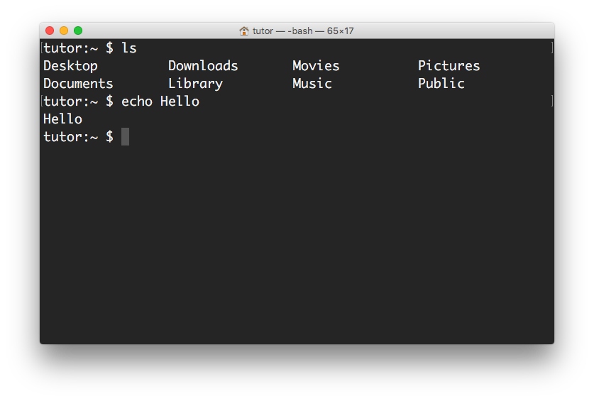

# 錄製教學影片

## 重點

* 錄影解析度: 1920 x 1080 (Full HD 1080p)
* 錄製整個桌面（建議搭配 1080p 外接螢幕）
* 使用 `tutor` 專用帳號
* 乾淨的桌面
* 專用的桌面底圖

## Account

Create "Trunk Studio (tutor)" system account for tutoring.


## Terminal

* Color Scheme: Pro (black bg + white fg)
* Font Family: Monaco
* Font Size: 18pt


## BASH Prompt

Customize BASH shell prompt.

Edit `~/.profile` to append:

```
export PS1="\u:\W \$ "
```


